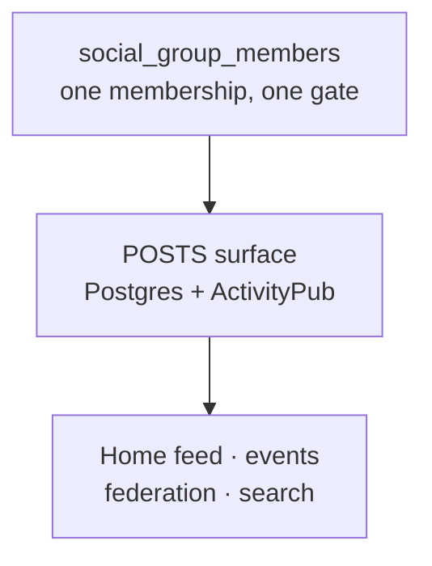

# Groups — Design & Roadmap

> **STATUS**: **Proposal. Nothing here is implemented.** No migration, table, route, or component
> described below exists yet. The next free migration number is `0043`.
>
> Two group-shaped systems already ship in this repo and **neither one is this feature**:
> NIP-29 relay groups under `/r/groups`, and the `Groups` stat already rendered next to Panas in
> the Pana Social feed rail. Both are inventoried in
> [What Already Exists](#what-already-exists) — read that before writing any code, because one of
> them is already wired to the exact UI slot this feature needs.

## Table of Contents

- [Overview](#overview)
- [What Already Exists](#what-already-exists)
- [Why Relay Groups Are Not The Answer](#why-relay-groups-are-not-the-answer)
- [Proposed Design](#proposed-design)
- [Schema](#schema)
- [Feed Integration](#feed-integration)
- [Search](#search)
- [Events](#events)
- [Roadmap](#roadmap)
- [Risks & Open Questions](#risks--open-questions)

---

## Overview

A pana should be able to start a group around any interest, find groups other panas have started,
see what those groups are posting without visiting each one, and let a group host events the same
way a business hosts them today.

The design goal underneath all of it, stated by the product owner and worth repeating because it
decides several arguments below:

> _"I don't want users to leave the pana system, so I'd rather build the chat and groups in our
> site."_

That single constraint is what rules out the existing relay-group approach, which works by handing
people a deeplink to a third-party Nostr client.

> **Real-time chat is out of scope for this document.** It is its own feature on its own surface —
> see `docs/CHAT-ROADMAP.md`. Groups ship without it. A group page is a slow surface: posts, events,
> roster.

### Goals

- Any pana can create a group around any interest, with no admin approval
- Groups are discoverable by name and topic, with the same typo tolerance the directory has
- Group posts appear in the home timeline of members, alongside posts from people they follow
- Groups can host events, exactly as profiles do now
- Group membership count appears next to the Panas count in the feed rail

### Non-Goals

- Replacing or retiring `/r/groups`. Relay groups stay as a separate bring-your-own-client feature
  for panas who want censorship-resistant Nostr rooms. This feature does not depend on Nostr at all.
- Federated group membership in v1. Remote actors can _follow_ a group actor and receive its public
  posts, but joining is local-only until the visibility rules have proven themselves.
- Real-time chat of any kind. Tracked separately in `docs/CHAT-ROADMAP.md`.

---

## What Already Exists

### 1. NIP-29 relay groups — `/r/groups`

Tables `relay_groups` (`lib/schema/index.ts:1975`), `relay_group_members` (`:2051`),
plus `relay_group_invites`, `relay_group_join_pending`, and `relay_group_leave_pending`.
The join-policy enum is at `:266`.

Membership keys on `profiles.nostrPubkey` (`:684-685`), which is the **only** bridge between user
space and pubkey space in the schema. A pana with no Nostr enrollment cannot be in a relay group.

Authority is split three ways, documented at `docs/RESILIENCE-ROADMAP.md:309` — _"panamia is sole
source of truth"_:

| Component                 | Responsibility                                                                            |
| ------------------------- | ----------------------------------------------------------------------------------------- |
| panamia (this repo)       | Owns membership and metadata; pushes to the relay over a Service Binding                  |
| `panamia-nosflare` Worker | NIP-42 AUTH, `h`-tag write gate, REQ-time filter narrowing; signs kinds 39000/39001/39002 |
| Third-party Nostr client  | **Where the messages actually happen**                                                    |

Client-published moderation kinds (9000, 9001, 9005, 9007, 9008, 9009) are rejected by the relay.
Kinds 9021/9022 join/leave are advisory only.

### 2. The feed rail already has a Groups slot

`app/s/_components/feed-rail.tsx` already renders Panas / Groups / Posts using `usePanas` and
`useProfileGroups`. The requirement _"group membership shows next to the panas number"_ is
**already built** — it currently counts relay groups, via
`app/api/social/actors/[username]/groups/route.ts`, which reads relay-group space through
`profiles.nostrPubkey`. That route is a repoint target, not new work.

### 3. Pana Social actors are hardcoded to `Person`

`socialActors` (`lib/schema/index.ts:1114`) has **no `type` column**, and
`app/api/federation/actor/[user]/route.ts:57` hardcodes `type: 'Person'` on every actor it serves.
This is the single most important schema gap for this feature.

---

## Why Relay Groups Are Not The Answer

Setting aside the Nostr enrollment requirement, relay groups fail four of the six goals outright:

- **No topic taxonomy and no search.** `/r/groups` offers an alphabetical browse of groups whose
  join policy is `open`. There is nothing to search against.
- **Default `invite_only`.** The opposite of "any pana can start a group around any interest and
  others can find it."
- **Cannot host events.** No relationship to the `events` table exists.
- **Messages are not in Postgres.** They live on the relay, so they cannot appear in a timeline
  query, be moderated here, or be included in an account-deletion sweep.
- **There is no group content surface in this repo.** `components/relay/groups/GroupDetail.tsx`
  renders a name, an about line, a member count, a member roster, and an invite box — and nothing
  else. `components/relay/ImportInstructions.tsx:7` hardcodes a deeplink to
  `https://web.nostrord.com/?relay=relay.pana.social&group=panamia-test`.

That last point is the whole argument. Relay groups send panas to Nostrord, Amethyst, or 0xchat to
do the actual talking, which is precisely the outcome the product owner ruled out. The key-custody
reason a Nostr-backed surface cannot simply be rebuilt here is documented in
`docs/CHAT-ROADMAP.md`.

---

## Proposed Design

Model a group as an **ActivityPub `Group` actor**. This is not an invention; `Group` is a standard
`as:Actor` subtype that Mastodon, Lemmy, and Guppe already federate. It means a group gets a
handle, an inbox, an outbox, followers, and an avatar for free, because `socialActors` already
provides all of it.

A group then exposes **one surface gated by one membership table**:



Chat was cut out of this design rather than deferred inside it, because **chat and posts are
different products** and it is easy to conflate them. Four of the five goals — feed, events,
membership counts, search — are async _post_ semantics. Chat delivers none of them: chat messages do
not belong in a timeline, cannot be liked or replied to three days later, and do not federate.
Building chat first would satisfy the "don't leave the site" constraint while leaving every original
requirement unmet.

If chat later turns out to be scoped to groups, it reads `social_group_members` like everything else
here does. That is the only coupling this document assumes, and `docs/CHAT-ROADMAP.md` is free to
reject it.

---

## Schema

### `social_actors` gains a type

```sql
ALTER TABLE social_actors
  ADD COLUMN type text NOT NULL DEFAULT 'Person';
```

The default backfills every existing row to the value `app/api/federation/actor/[user]/route.ts:57`
already hardcodes, so the change is invisible to existing actors. That route must then read the
column instead of the literal.

**`PUBLIC_ACTOR_COLUMNS` (`lib/schema/index.ts` ~`:1160`) must gain `type`.** That list is a
deliberate _allowlist_, not a denylist — the comment there explains the reasoning, which is that
forgetting an allowlist entry is a visible bug while forgetting a denylist entry silently publishes
`social_actors.privateKey`. A new column that is not added there simply will not appear in actor
JSON, and federation will quietly treat every group as a Person.

### `social_groups`

```ts
export const socialGroups = pgTable('social_groups', {
  id: text('id')
    .primaryKey()
    .$defaultFn(() => createId()),
  actorId: text('actor_id')
    .notNull()
    .unique()
    .references(() => socialActors.id, { onDelete: 'cascade' }),
  createdByProfileId: text('created_by_profile_id').references(
    () => profiles.id,
    { onDelete: 'set null' }
  ),
  topics: jsonb('topics')
    .$type<Record<string, boolean>>()
    .notNull()
    .default({}),
  rules: jsonb('rules').$type<string[]>().notNull().default([]),
  visibility: socialGroupVisibility('visibility').notNull().default('public'),
  joinPolicy: socialGroupJoinPolicy('join_policy').notNull().default('open'),
  memberCount: integer('member_count').notNull().default(0),
  createdAt: timestamp('created_at', { withTimezone: true })
    .notNull()
    .defaultNow(),
  updatedAt: timestamp('updated_at', { withTimezone: true })
    .notNull()
    .defaultNow(),
});
```

`socialActors.profileId` is `.unique()` but nullable, so group actors carry `NULL` there. Postgres
permits many NULLs in a unique index — the same pattern `profiles.userId` already documents.

The group's name and description are **not** columns here. They live on the actor as
`socialActors.name` and `socialActors.summary`, which is where every other actor in the system
already keeps them and what the ActivityPub serialiser already reads. Duplicating them onto
`social_groups` would create two places to change a group's name and, eventually, two different
answers to what it is called.

`topics` follows the established JSONB `{key: true}` flag-map convention (`categories`, `counties`
on `profiles`), which means `pana_jsonb_flags` from migration `0040` can already flatten it into a
search vector.

`rules` is a JSONB **array**, not a flag map, because house rules are numbered when displayed and
order carries meaning. They are prose rather than facets, so they are never searched or aggregated.

### `social_group_members`

```ts
export const socialGroupMembers = pgTable(
  'social_group_members',
  {
    id: text('id')
      .primaryKey()
      .$defaultFn(() => createId()),
    groupId: text('group_id')
      .notNull()
      .references(() => socialGroups.id, { onDelete: 'cascade' }),
    actorId: text('actor_id')
      .notNull()
      .references(() => socialActors.id, { onDelete: 'cascade' }),
    role: socialGroupRole('role').notNull().default('member'),
    status: socialGroupMemberStatus('status').notNull().default('active'),
    joinedAt: timestamp('joined_at', { withTimezone: true }),
  },
  (t) => ({
    uniqueMember: unique('social_group_members_group_actor_key').on(
      t.groupId,
      t.actorId
    ),
    actorIdx: index('social_group_members_actor_idx').on(t.actorId),
  })
);
```

**Key on `actorId`, not `profileId`.** A profile key is simpler today and wrong tomorrow: it makes
federated membership a migration rather than a feature, and it cannot represent a group joining a
group. The `actorId` index exists because the hot query is "every group this actor belongs to",
which runs on every timeline fetch.

### `social_statuses` gains a group

```sql
ALTER TABLE social_statuses
  ADD COLUMN group_id text REFERENCES social_groups(id) ON DELETE CASCADE;
CREATE INDEX social_statuses_group_published_idx
  ON social_statuses (group_id, published DESC) WHERE group_id IS NOT NULL;
```

`NULL` means an ordinary personal post, which is every row that exists today.

---

## Feed Integration

`getHomeTimeline` (`lib/federation/wrappers/timeline.ts:112`) builds `timelineActorIds` from
accepted `social_follows` plus self, then filters statuses on `isNotNull(published)`,
`isNull(inReplyToId)`, and **public addressing**:

```ts
or(
  jsonbArrayContains(recipientTo, PUBLIC),
  jsonbArrayContains(recipientCc, PUBLIC)
);
```

> ### The trap
>
> A private group's posts are **not** PUBLIC-addressed. Adding `groupId` to the existing `WHERE`
> clause means every private group post is silently filtered out, and the bug presents as "groups
> just don't work" with no error anywhere.

The group branch must be a **separate `or()` arm that does not require public addressing**:

```ts
where: or(
  and(
    inArray(socialStatuses.actorId, timelineActorIds),
    isNull(socialStatuses.groupId), // don't double-render group posts
    or(
      jsonbArrayContains(socialStatuses.recipientTo, PUBLIC),
      jsonbArrayContains(socialStatuses.recipientCc, PUBLIC)
    )
  ),
  and(
    inArray(socialStatuses.groupId, memberGroupIds)
    // no public-addressing requirement — membership is the authorization
  )
);
```

The `isNull(groupId)` on the follow arm is not redundant. Without it, a post to a group you are in,
written by someone you also follow, matches both arms and renders twice.

---

## Search

Copy the directory pattern wholesale — migrations `0040_profile_search_vector.sql` and
`0041_profile_name_trigram.sql` already solved this problem for profiles, and
`docs/SEARCH-ROADMAP.md` documents the outcome with measured results.

- A stored `tsvector` on `social_groups`, weighted `A` name → `B` topics → `C` summary, generated
  across the same three configs migration `0040` uses — `english`, `spanish`, and `simple`
- `pana_jsonb_flags` already flattens `{key: true}` JSONB maps into text, so `topics` drops straight
  into the vector with no new helper
- `pana_unaccent` is already `IMMUTABLE` and reusable as-is
- `pg_trgm` trigram fallback on `name`, fired **only when full-text returns zero rows** — Phase 2 of
  the search roadmap explains why "zero" beats "few" as the trigger
- `word_similarity_threshold` at `0.5`, not the Postgres default of `0.6`

> **Gotcha, already paid for once:** `pg_trgm` and `unaccent` must be schema-qualified (`public.` or
> `extensions.`) in **three separate places** or the index and operators fail at migration time.
> `docs/SEARCH-ROADMAP.md` has the specifics.

---

## Events

`events.hostProfileId` (`lib/schema/index.ts:1513`) is `NOT NULL` with `onDelete: 'restrict'`.
Letting a group host an event therefore requires three coordinated changes:

```sql
ALTER TABLE events ADD COLUMN host_group_id text
  REFERENCES social_groups(id) ON DELETE RESTRICT;
ALTER TABLE events ALTER COLUMN host_profile_id DROP NOT NULL;
ALTER TABLE events ADD CONSTRAINT events_single_host CHECK (
  (host_profile_id IS NOT NULL AND host_group_id IS NULL) OR
  (host_profile_id IS NULL AND host_group_id IS NOT NULL)
);
```

The `CHECK` is what keeps `DROP NOT NULL` from being a regression. Without it the schema permits a
hostless event, and every consumer of `events` grows a defensive branch for a state that should be
impossible.

`event_attendees` (`:1580`) needs no change — attendance is by actor and does not care who hosts.

---

## Roadmap

Each phase is independently shippable. All four are pure Postgres and ActivityPub — none of them
touch Worker configuration or add infrastructure.

### Phase 1 — Groups exist (shipped)

- Migration `0043`: `social_actors.type`, `social_groups`, `social_group_members`, four enums
  (`socialGroupVisibility`, `socialGroupJoinPolicy`, `socialGroupRole`, `socialGroupMemberStatus`,
  named to match the existing `relayGroupJoinPolicy` convention rather than the `*Enum` suffix
  sketched above)
- `PUBLIC_ACTOR_COLUMNS` gains `type`; the actor route reads the column instead of the literal
- `lib/federation/wrappers/group.ts`: `createGroup`, `joinGroup`, `leaveGroup`, `getGroupByHandle`,
  `getMembership`
- `POST /api/social/groups`, `GET /api/social/groups/[handle]`,
  `POST|DELETE /api/social/groups/[handle]/join`
- Group handles registered through `lib/screenname.ts`, closing the collision risk below

Three rules were enforced in the wrapper rather than left to callers, because each of them is a way
to strand or corrupt a group: the last active admin cannot leave, a banned member cannot leave
(deleting the row would let them rejoin an open group in one tap — the row _is_ the ban), and
joining twice returns the existing membership instead of inflating `member_count`.

### Phase 2 — Discovery

- `search_vector` + trigram fallback on `social_groups`, per [Search](#search)
- Topic browse and group search UI
- **Repoint** `app/api/social/actors/[username]/groups/route.ts` at `social_group_members`.
  `feed-rail.tsx` needs no change — the Groups stat starts counting the new groups on its own.

### Phase 3 — Group updates in the feed

- `social_statuses.group_id` + partial index
- The two-arm `getHomeTimeline` rewrite in [Feed Integration](#feed-integration)
- **Audit every status-reading path for group visibility** — see [Risks](#risks--open-questions)

### Phase 4 — Group-hosted events

- `events.host_group_id`, `DROP NOT NULL`, and the single-host `CHECK`
- Event creation UI gains a host selector for groups the pana can administer

---

## Risks & Open Questions

### Handle namespace collision — fixed in phase 1

`lib/screenname.ts` enforces a **flat** namespace across `users.screenname`, `profiles.screenname`,
and `screenname_history`, via `RESERVED_SCREENNAMES`, `isScreennameAvailable`, and
`validateScreennameFull`. Group handles must join that namespace. If they do not, a group can take a
handle a pana already has, and `/p/:handle` plus WebFinger become ambiguous — with WebFinger
ambiguity visible to every federated server, not just to us.

`isScreennameAvailable` now checks a fourth source: `social_groups` joined to `social_actors`, so
the lookup can only ever match a local group and never a remote actor that happens to share a
username. `createGroup` runs every handle through `validateScreennameFull` before minting anything.

### Private group leakage — the highest-severity risk

Membership is the authorization for group posts, which means **every** path that reads
`social_statuses` needs a group filter, not just the home timeline: actor outboxes, the public
`/api/federation/outbox`, status permalinks, article comment threads, search results, notifications,
and any future export. The timeline is simply the most obvious one.

The failure mode is silent and unrecoverable: a private post rendered once to a non-member cannot be
un-rendered, and if it leaked through an outbox it has already been fetched by remote servers.
Phase 3 should enumerate these call sites explicitly and add a test per path.

### Open questions

- **Should a group actor be followable by remote servers before local visibility rules are proven?**
  Recommendation: no. Ship public group posts locally in phase 3, enable federation in a phase 3.5
  once the outbox filter has been audited.
- **Do relay groups eventually bind to social groups** via a `relayGroupId` column, or stay fully
  separate? Staying separate is simpler and is the assumption throughout this document.
  Note that `docs/RESILIENCE-ROADMAP.md:551` already plans a Nostr→ActivityPub bridge in the
  opposite direction, which may make this moot.
- **Do groups need a `rules` column?** Resolved in phase 1: yes, as a JSONB array. The mock renders
  numbered house rules in the rail, and a group with no stated rules is a moderation problem waiting
  to happen.
- **Is chat eventually scoped to groups?** If it is, it reads `social_group_members` and nothing in
  this document changes. Tracked in `docs/CHAT-ROADMAP.md`, which is not obliged to land there.
