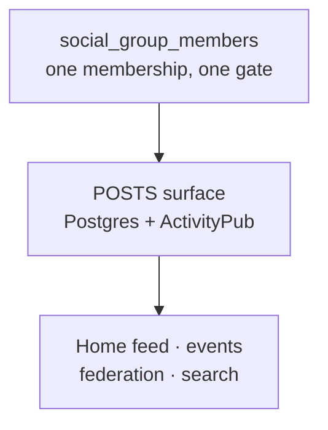

# Groups — Design & Roadmap

> **STATUS**: **Proposal. Nothing here is implemented.** No migration, table, route, or component
> described below exists yet. The next free migration number is `0043`.
>
> Two group-shaped systems already ship in this repo and **neither one is this feature**:
> NIP-29 relay groups under `/r/groups`, and the `Groups` stat already rendered next to Panas in
> the Pana Social feed rail. Both are inventoried in
> [What Already Exists](#what-already-exists) — read that before writing any code, because one of
> them is already wired to the exact UI slot this feature needs.

## Table of Contents

- [Overview](#overview)
- [What Already Exists](#what-already-exists)
- [Why Relay Groups Are Not The Answer](#why-relay-groups-are-not-the-answer)
- [Proposed Design](#proposed-design)
- [Schema](#schema)
- [Feed Integration](#feed-integration)
- [Search](#search)
- [Events](#events)
- [Roadmap](#roadmap)
- [Risks & Open Questions](#risks--open-questions)

---

## Overview

A pana should be able to start a group around any interest, find groups other panas have started,
see what those groups are posting without visiting each one, and let a group host events the same
way a business hosts them today.

The design goal underneath all of it, stated by the product owner and worth repeating because it
decides several arguments below:

> _"I don't want users to leave the pana system, so I'd rather build the chat and groups in our
> site."_

That single constraint is what rules out the existing relay-group approach, which works by handing
people a deeplink to a third-party Nostr client.

> **Real-time chat is out of scope for this document.** It is its own feature on its own surface —
> see `docs/CHAT-ROADMAP.md`. Groups ship without it. A group page is a slow surface: posts, events,
> roster.

### Goals

- Any pana can create a group around any interest, with no admin approval
- Groups are discoverable by name and topic, with the same typo tolerance the directory has
- Group posts appear in the home timeline of members, alongside posts from people they follow
- Groups can host events, exactly as profiles do now
- Group membership count appears next to the Panas count in the feed rail

### Non-Goals

- Replacing or retiring `/r/groups`. Relay groups stay as a separate bring-your-own-client feature
  for panas who want censorship-resistant Nostr rooms. This feature does not depend on Nostr at all.
- Federated group membership in v1. Remote actors can _follow_ a group actor and receive its public
  posts, but joining is local-only until the visibility rules have proven themselves.
- Real-time chat of any kind. Tracked separately in `docs/CHAT-ROADMAP.md`.

---

## What Already Exists

### 1. NIP-29 relay groups — `/r/groups`

Tables `relay_groups` (`lib/schema/index.ts:1975`), `relay_group_members` (`:2051`),
plus `relay_group_invites`, `relay_group_join_pending`, and `relay_group_leave_pending`.
The join-policy enum is at `:266`.

Membership keys on `profiles.nostrPubkey` (`:684-685`), which is the **only** bridge between user
space and pubkey space in the schema. A pana with no Nostr enrollment cannot be in a relay group.

Authority is split three ways, documented at `docs/RESILIENCE-ROADMAP.md:309` — _"panamia is sole
source of truth"_:

| Component                 | Responsibility                                                                            |
| ------------------------- | ----------------------------------------------------------------------------------------- |
| panamia (this repo)       | Owns membership and metadata; pushes to the relay over a Service Binding                  |
| `panamia-nosflare` Worker | NIP-42 AUTH, `h`-tag write gate, REQ-time filter narrowing; signs kinds 39000/39001/39002 |
| Third-party Nostr client  | **Where the messages actually happen**                                                    |

Client-published moderation kinds (9000, 9001, 9005, 9007, 9008, 9009) are rejected by the relay.
Kinds 9021/9022 join/leave are advisory only.

### 2. The feed rail already has a Groups slot

`app/s/_components/feed-rail.tsx` already renders Panas / Groups / Posts using `usePanas` and
`useProfileGroups`. The requirement _"group membership shows next to the panas number"_ is
**already built** — it currently counts relay groups, via
`app/api/social/actors/[username]/groups/route.ts`, which reads relay-group space through
`profiles.nostrPubkey`. That route is a repoint target, not new work.

### 3. Pana Social actors are hardcoded to `Person`

`socialActors` (`lib/schema/index.ts:1114`) has **no `type` column**, and
`app/api/federation/actor/[user]/route.ts:57` hardcodes `type: 'Person'` on every actor it serves.
This is the single most important schema gap for this feature.

---

## Why Relay Groups Are Not The Answer

Setting aside the Nostr enrollment requirement, relay groups fail four of the six goals outright:

- **No topic taxonomy and no search.** `/r/groups` offers an alphabetical browse of groups whose
  join policy is `open`. There is nothing to search against.
- **Default `invite_only`.** The opposite of "any pana can start a group around any interest and
  others can find it."
- **Cannot host events.** No relationship to the `events` table exists.
- **Messages are not in Postgres.** They live on the relay, so they cannot appear in a timeline
  query, be moderated here, or be included in an account-deletion sweep.
- **There is no group content surface in this repo.** `components/relay/groups/GroupDetail.tsx`
  renders a name, an about line, a member count, a member roster, and an invite box — and nothing
  else. `components/relay/ImportInstructions.tsx:7` hardcodes a deeplink to
  `https://web.nostrord.com/?relay=relay.pana.social&group=panamia-test`.

That last point is the whole argument. Relay groups send panas to Nostrord, Amethyst, or 0xchat to
do the actual talking, which is precisely the outcome the product owner ruled out. The key-custody
reason a Nostr-backed surface cannot simply be rebuilt here is documented in
`docs/CHAT-ROADMAP.md`.

---

## Proposed Design

Model a group as an **ActivityPub `Group` actor**. This is not an invention; `Group` is a standard
`as:Actor` subtype that Mastodon, Lemmy, and Guppe already federate. It means a group gets a
handle, an inbox, an outbox, followers, and an avatar for free, because `socialActors` already
provides all of it.

A group then exposes **one surface gated by one membership table**:



Chat was cut out of this design rather than deferred inside it, because **chat and posts are
different products** and it is easy to conflate them. Four of the five goals — feed, events,
membership counts, search — are async _post_ semantics. Chat delivers none of them: chat messages do
not belong in a timeline, cannot be liked or replied to three days later, and do not federate.
Building chat first would satisfy the "don't leave the site" constraint while leaving every original
requirement unmet.

If chat later turns out to be scoped to groups, it reads `social_group_members` like everything else
here does. That is the only coupling this document assumes, and `docs/CHAT-ROADMAP.md` is free to
reject it.

---

## Schema

### `social_actors` gains a type

```sql
ALTER TABLE social_actors
  ADD COLUMN type text NOT NULL DEFAULT 'Person';
```

The default backfills every existing row to the value `app/api/federation/actor/[user]/route.ts:57`
already hardcodes, so the change is invisible to existing actors. That route must then read the
column instead of the literal.

**`PUBLIC_ACTOR_COLUMNS` (`lib/schema/index.ts` ~`:1160`) must gain `type`.** That list is a
deliberate _allowlist_, not a denylist — the comment there explains the reasoning, which is that
forgetting an allowlist entry is a visible bug while forgetting a denylist entry silently publishes
`social_actors.privateKey`. A new column that is not added there simply will not appear in actor
JSON, and federation will quietly treat every group as a Person.

### `social_groups`

```ts
export const socialGroups = pgTable('social_groups', {
  id: text('id')
    .primaryKey()
    .$defaultFn(() => createId()),
  actorId: text('actor_id')
    .notNull()
    .unique()
    .references(() => socialActors.id, { onDelete: 'cascade' }),
  createdByProfileId: text('created_by_profile_id').references(
    () => profiles.id,
    { onDelete: 'set null' }
  ),
  topics: jsonb('topics')
    .$type<Record<string, boolean>>()
    .notNull()
    .default({}),
  rules: jsonb('rules').$type<string[]>().notNull().default([]),
  visibility: socialGroupVisibility('visibility').notNull().default('public'),
  joinPolicy: socialGroupJoinPolicy('join_policy').notNull().default('open'),
  memberCount: integer('member_count').notNull().default(0),
  createdAt: timestamp('created_at', { withTimezone: true })
    .notNull()
    .defaultNow(),
  updatedAt: timestamp('updated_at', { withTimezone: true })
    .notNull()
    .defaultNow(),
});
```

`socialActors.profileId` is `.unique()` but nullable, so group actors carry `NULL` there. Postgres
permits many NULLs in a unique index — the same pattern `profiles.userId` already documents.

The group's name and description are **not** columns here. They live on the actor as
`socialActors.name` and `socialActors.summary`, which is where every other actor in the system
already keeps them and what the ActivityPub serialiser already reads. Duplicating them onto
`social_groups` would create two places to change a group's name and, eventually, two different
answers to what it is called.

`topics` follows the established JSONB `{key: true}` flag-map convention (`categories`, `counties`
on `profiles`), which means `pana_jsonb_flags` from migration `0040` can already flatten it into a
search vector.

`rules` is a JSONB **array**, not a flag map, because house rules are numbered when displayed and
order carries meaning. They are prose rather than facets, so they are never searched or aggregated.

### `social_group_members`

```ts
export const socialGroupMembers = pgTable(
  'social_group_members',
  {
    id: text('id')
      .primaryKey()
      .$defaultFn(() => createId()),
    groupId: text('group_id')
      .notNull()
      .references(() => socialGroups.id, { onDelete: 'cascade' }),
    actorId: text('actor_id')
      .notNull()
      .references(() => socialActors.id, { onDelete: 'cascade' }),
    role: socialGroupRole('role').notNull().default('member'),
    status: socialGroupMemberStatus('status').notNull().default('active'),
    joinedAt: timestamp('joined_at', { withTimezone: true }),
  },
  (t) => ({
    uniqueMember: unique('social_group_members_group_actor_key').on(
      t.groupId,
      t.actorId
    ),
    actorIdx: index('social_group_members_actor_idx').on(t.actorId),
  })
);
```

**Key on `actorId`, not `profileId`.** A profile key is simpler today and wrong tomorrow: it makes
federated membership a migration rather than a feature, and it cannot represent a group joining a
group. The `actorId` index exists because the hot query is "every group this actor belongs to",
which runs on every timeline fetch.

### `social_statuses` gains a group

```sql
ALTER TABLE social_statuses
  ADD COLUMN group_id text REFERENCES social_groups(id) ON DELETE CASCADE;
CREATE INDEX social_statuses_group_published_idx
  ON social_statuses (group_id, published DESC) WHERE group_id IS NOT NULL;
```

`NULL` means an ordinary personal post, which is every row that exists today.

---

## Feed Integration

`getHomeTimeline` (`lib/federation/wrappers/timeline.ts:112`) builds `timelineActorIds` from
accepted `social_follows` plus self, then filters statuses on `isNotNull(published)`,
`isNull(inReplyToId)`, and **public addressing**:

```ts
or(
  jsonbArrayContains(recipientTo, PUBLIC),
  jsonbArrayContains(recipientCc, PUBLIC)
);
```

> ### The trap
>
> A private group's posts are **not** PUBLIC-addressed. Adding `groupId` to the existing `WHERE`
> clause means every private group post is silently filtered out, and the bug presents as "groups
> just don't work" with no error anywhere.

The group branch must be a **separate `or()` arm that does not require public addressing**:

```ts
where: or(
  and(
    inArray(socialStatuses.actorId, timelineActorIds),
    isNull(socialStatuses.groupId), // don't double-render group posts
    or(
      jsonbArrayContains(socialStatuses.recipientTo, PUBLIC),
      jsonbArrayContains(socialStatuses.recipientCc, PUBLIC)
    )
  ),
  and(
    inArray(socialStatuses.groupId, memberGroupIds)
    // no public-addressing requirement — membership is the authorization
  )
);
```

The `isNull(groupId)` on the follow arm is not redundant. Without it, a post to a group you are in,
written by someone you also follow, matches both arms and renders twice.

---

## Search

Copy the directory pattern wholesale — migrations `0040_profile_search_vector.sql` and
`0041_profile_name_trigram.sql` already solved this problem for profiles, and
`docs/SEARCH-ROADMAP.md` documents the outcome with measured results.

**Shipped as `0045_group_search_vector.sql`**, with one change forced by Phase 1's schema.

The original plan called for a single `tsvector` on `social_groups` weighted
`A` name → `B` topics → `C` summary. That is not buildable: Phase 1 put `name` and `summary` on
`social_actors` (a group **is** an actor, and those are the actor's own fields) while `topics` lives
on `social_groups`, and a `GENERATED` column can only read its own row. Denormalising a copy of the
name onto `social_groups` was considered and rejected — a second copy is a second thing to keep in
step on rename, and when it drifts the symptom is "search finds the old name" with nothing logged.

As built, each table gets a generated vector over the fields it actually owns:

| Vector                        | Weight | Fields    |
| ----------------------------- | ------ | --------- |
| `social_actors.search_vector` | `A`    | `name`    |
|                               | `C`    | `summary` |
| `social_groups.search_vector` | `B`    | `topics`  |

Both are `GENERATED ALWAYS ... STORED`, both are GIN-indexed, and both are generated across the same
three configs migration `0040` uses — `english`, `spanish`, and `simple`. `pana_jsonb_flags` and
`pana_unaccent` are reused as-is with no new helper. Indexing **all** actors rather than only
`type = 'Group'` is deliberate: a partial index would force every query to repeat the whole weighted
expression verbatim to be used at all, and people search gets the same index for free later.

- `pg_trgm` trigram fallback on `social_actors.name`, fired **only when full-text returns zero rows**
  — Phase 2 of the search roadmap explains why "zero" beats "few" as the trigger
- `word_similarity_threshold` at `0.5`, not the Postgres default of `0.6`

> **Gotcha, already paid for once:** `pg_trgm` and `unaccent` must be schema-qualified (`public.` or
> `extensions.`) in **three separate places** or the index and operators fail at migration time.
> `docs/SEARCH-ROADMAP.md` has the specifics.

> **Ranking gotcha, specific to the two-vector split:** `setweight` only orders terms _within_ one
> `tsvector`. Across the join the `A`/`B`/`C` labels are not automatically comparable — what makes
> them line up is that `lib/server/group-search.ts` passes the **same** weight array to both
> `ts_rank_cd` calls and sums the results. Giving the group vector its own weights would silently
> reorder results.

---

## Events

`events.hostProfileId` (`lib/schema/index.ts:1513`) is `NOT NULL` with `onDelete: 'restrict'`.
Letting a group host an event therefore requires three coordinated changes:

```sql
ALTER TABLE events ADD COLUMN host_group_id text
  REFERENCES social_groups(id) ON DELETE RESTRICT;
ALTER TABLE events ALTER COLUMN host_profile_id DROP NOT NULL;
ALTER TABLE events ADD CONSTRAINT events_single_host CHECK (
  (host_profile_id IS NOT NULL AND host_group_id IS NULL) OR
  (host_profile_id IS NULL AND host_group_id IS NOT NULL)
);
```

The `CHECK` is what keeps `DROP NOT NULL` from being a regression. Without it the schema permits a
hostless event, and every consumer of `events` grows a defensive branch for a state that should be
impossible.

`event_attendees` (`:1580`) needs no change — attendance is by actor and does not care who hosts.

---

## Roadmap

Each phase is independently shippable. All four are pure Postgres and ActivityPub — none of them
touch Worker configuration or add infrastructure.

### Phase 1 — Groups exist (shipped)

- Migration `0043`: `social_actors.type`, `social_groups`, `social_group_members`, four enums
  (`socialGroupVisibility`, `socialGroupJoinPolicy`, `socialGroupRole`, `socialGroupMemberStatus`,
  named to match the existing `relayGroupJoinPolicy` convention rather than the `*Enum` suffix
  sketched above)
- `PUBLIC_ACTOR_COLUMNS` gains `type`; the actor route reads the column instead of the literal
- `lib/federation/wrappers/group.ts`: `createGroup`, `joinGroup`, `leaveGroup`, `getGroupByHandle`,
  `getMembership`
- `POST /api/social/groups`, `GET /api/social/groups/[handle]`,
  `POST|DELETE /api/social/groups/[handle]/join`
- Group handles registered through `lib/screenname.ts`, closing the collision risk below

Three rules were enforced in the wrapper rather than left to callers, because each of them is a way
to strand or corrupt a group: the last active admin cannot leave, a banned member cannot leave
(deleting the row would let them rejoin an open group in one tap — the row _is_ the ban), and
joining twice returns the existing membership instead of inflating `member_count`.

### Phase 2 — Discovery (shipped)

- Migration `0044`: generated `search_vector` on **both** `social_actors` and `social_groups`, GIN
  indexes on each, and `social_actors_name_trgm_idx` for the fallback arm — see [Search](#search)
  for why the single-vector plan above could not be built
- `lib/server/group-search.ts`: `searchGroups`, `browseGroups`, `trigramSearch`, mirroring
  `lib/server/directory.ts`
- `GET /api/social/groups` — searches on `?q=`, browses newest-first when `q` is empty
- **Repointed** `app/api/social/actors/[username]/groups/route.ts` at `social_group_members`.
  `feed-rail.tsx` needed no change — the Groups stat started counting social groups on its own.
- `tests-db/group-search.test.ts` covers ranking order, accent folding, stemming, the trigram
  fallback, and both profile-privacy filters

Two decisions worth knowing before building on top:

- **Private groups are returned by search**, identity fields only — never posts, roster, or events.
  A `joinPolicy: 'request'` group nobody can find is a group nobody can request. The rationale lives
  in the `GROUP_COLUMNS` docblock so it can be reversed in one place if `invite`-only groups should
  stop being enumerable.
- **`listPublicGroupsForActor` filters to public + active**, a deliberately stricter rule than
  search uses. A private group on a public profile leaks both that the group exists and that this
  person is in it. That invariant is what lets `GroupCard` render no privacy marker at all.

The UI that sits on this:

- `/search` — Panas and Groups tabs, reached from the masthead field, which stopped pointing at
  `/directory/search`. Only the open tab is mounted, so a search costs one request and the tabs
  carry no counts. Panas shows the top six and hands off to the directory, which owns the filters
  and the map; groups are answered in full, because this is their only search surface.
- `/g/<handle>` — the group home, following `app/mock/group` minus the posts, events and roster
  tabs that need Phase 3. A private group renders its identity block and a locked panel.
- Both sit at the **top level rather than under `/s`**, joining `/p` and `/inbox`. `worker/index.ts`
  notes the end state is moving the social routes into a route group so the surface root is `/`;
  `/g/<handle>` is already where it will live then, and `/s/g/<handle>` would have to move and break
  every link minted in the meantime. `/p/<user>` is a person, `/g/<handle>` is a group.
- `/search` is **`noindex`**. Private groups being discoverable assumes a person doing the searching;
  a crawlable results page turns that into bulk enumeration. A private group page is `noindex` too,
  so it is reachable by handle and nowhere else.

Still open: topic browse (the chips on a group are not yet links).

### Phase 3 — Group updates in the feed — shipped

- `social_statuses.group_id` + partial index (migration `0045`). `ON DELETE CASCADE`, not `SET
NULL`: nulling the column would strip the only marker making those posts private and quietly
  promote every one of them into a personal post on the author's public profile.
- The two-arm `getHomeTimeline` rewrite in [Feed Integration](#feed-integration). `isNull(groupId)`
  on the follow arm is load-bearing — without it a post in a group you are in, by someone you also
  follow, matches both arms and renders twice.
- `lib/federation/wrappers/group-visibility.ts` holds the rule **once**. Twelve hand-written copies
  of a security predicate is twelve chances to write `OR` where `AND` belongs, and the eleven
  correct copies give no warning about the twelfth.
- `POST /api/social/groups/[handle]/posts` for writing, `GET` for reading, and the group's posts now
  render on `/g/[handle]` with a composer for members.
- A "Posted in …" line on the feed card, carrying a lock for private groups so a member can tell
  what is safe to quote elsewhere.
- `tests-db/group-feed.test.ts` — 24 tests, one per read path.

**The audit found three leaks beyond the documented trap:**

1. **`getActorPosts` had no addressing filter at all.** A private group post rendered on its
   author's public profile to anyone. The author is public, so nothing else in the query would have
   stopped it. The most severe of the three.
2. **`getSentDirectMessages` finds DMs by "not publicly addressed"** — which is also true of every
   private group post, so they filed themselves into the author's Sent list. Only leaks to
   yourself, but it proves the "not public" heuristic is now ambiguous and cannot be trusted alone.
3. **`getAtMeTimeline`** — a mention inside a private group post handed the content to a non-member
   by naming them.

Also gated: `getPublicTimeline`, `getReceivedDirectMessages`, `getStatusWithLikeStatus`,
`getStatusReplies`, `likeStatus`/`unlikeStatus`, and the federation outbox.

`getStatusByUri` is deliberately **not** filtered — it is how federation resolves a URI it was
handed, where the caller is the system and returning null breaks delivery rather than protecting
anything. Any path showing its result to a human must gate with `canViewStatusGroup`.

Permalinks return **404, not 403**: a 403 confirms the post exists, which is half of what the group
was keeping.

Still open: group actors do not federate at all yet — the outbox excludes **every** group post,
public ones included. A remote server has no notion of our membership table, so once a post leaves
we have handed over the only thing enforcing who may read it. See phase 3.5 below.

### Phase 3.5 — Group federation

- Audit the inbox side before letting group posts out: delivery, `Announce`, and reply threading
  all resolve statuses by URI, which is ungated by design.
- Decide whether private groups federate at all, or whether the group actor publishes only public
  groups' posts.

### Phase 4 — The front door — **shipped**

Phases 1–3 built the engine and no way in. `POST /api/social/groups` was complete, tested and
**unreachable**: nothing in the UI called it, no page linked to groups, and the database held zero
of them. A phase plan organised by layer can ship every layer and still leave the feature unusable
— worth remembering the next time one of these documents is written.

- `listMyGroups(actorId)` and `GET /api/social/actors/me/groups` — the member's own list.
- `/groups` — your groups above a browse/search section, and `/groups/new` — the create form.
- `useMyGroups` / `useCreateGroup`.
- A **"Groups you run"** section in the identity menu, placed **below** the acting-as list and
  outside it. Groups are navigation, not an identity: phase 3 made a group post authored by the
  member and merely _attributed_ to the group, so putting groups in the identity switcher would
  promise a "post as the group" mode this system does not have.
- The feed rail's Groups stat now links to `/groups`.

**The two-list rule.** `listPublicGroupsForActor` and `listMyGroups` are deliberate opposites and
must never be swapped:

|                            | answers                                      | visibility       |
| -------------------------- | -------------------------------------------- | ---------------- |
| `listPublicGroupsForActor` | "what may a stranger know about this person" | public only      |
| `listMyGroups`             | "where do I belong"                          | all, plus `role` |

The rail was using the **public** list for the member's own count, so anyone in a private group was
told they were in fewer groups than they are, on their own feed. Fixed here, and pinned by two
tests. `listMyGroups` takes **no `viewerActorId`** — there is no parameter to point at someone
else, so the safety is structural rather than remembered.

**Join policy is capped at `open` for now.** `joinGroup` already honours `request` and `invite`,
but nothing exists to approve a request or send an invite, and **there is no edit endpoint** — so
either choice would be a permanent dead end, with an invite-only group unable to ever gain a second
member. Both options render in the create form, disabled and labelled, so the roadmap is visible
without being a trap.

### Phase 5 — Group-hosted events — shipped

- `events.host_group_id`, `DROP NOT NULL`, and the single-host `CHECK` (migration `0047`)
- Event creation UI gains a host selector for groups the pana can administer
- `lib/server/event-host.ts`: `canManageEvent` and `listHostableGroups`
- `GET /api/social/groups/[handle]/events` and the group page's Events section

The scope above missed the part that actually blocked the feature. Six call sites authorized events
by comparing `profile.id === event.hostProfileId` inline. With a group hosting, `host_profile_id` is
NULL, so every one of those comparisons is false for everybody — not a leak, but the event becomes
unmanageable by anyone, including the group that owns it. They now share `canManageEvent`:

- `app/e/[slug]/page.tsx` (draft visibility), `app/e/[slug]/manage/page.tsx`,
  `app/e/[slug]/manage/attendees/page.tsx`
- `app/api/events/[slug]/route.ts`, `app/api/events/[slug]/rsvp/list/route.ts`,
  `app/api/events/[slug]/publish/route.ts`

**Why the group hosts outright rather than being credited.** The tempting design mirrors Phase 3
group posts: keep `host_profile_id` as the creator and add `host_group_id` for attribution. Account
deletion rules it out. `lib/server/delete-account.ts` blocks deletion while you host upcoming events
and deletes your completed ones, so a founder leaving would be gated on events the group owns and
would take the group's past events with them. With the group as sole host, `host_profile_id` is NULL
and those queries never match, so the calendar outlives whoever set it up. `delete-account.ts` needed
no change at all, which is the sign the model is right.

**Also corrected:** the publish route crossposted `hostName: profile.name`, the _publisher's_ name.
Harmless while publisher and host were always the same person; for a group event it would credit an
admin off-platform for the group's event.

---

## Phase 6 — Event Transfer & Group Deletion

The two gaps Phase 5 left open. Both shipped.

### Transferring an event between hosts

`POST /api/events/[slug]/transfer` takes `{ hostGroupId: string | null }`, where `null` means "take
it into my own name". This is what makes the account-deletion blocker's promise — _"Cancel or
transfer them first"_ — actually keepable.

**Self-service only.** You can move an event between yourself and groups you run. Person-to-person
transfer was deliberately declined: it would need a pending-transfer record, notifications, and an
accept/decline handshake, because handing someone an obligation they did not ask for is not
something one party should be able to do alone.

**The authorization is asymmetric on purpose.** Transferring an event _away_ from a group requires
**admin** (`TRANSFER_ROLES`); transferring one _in_ reuses `listHostableGroups`, which allows
**admin or moderator**. A moderator can already make the group host a brand-new event, so letting
them move one in grants nothing new — but moving events _out_ is how a group loses its calendar, so
that stays with admins.

**The consequence, surfaced in the UI:** moving your own event into a group where you are only a
moderator is a one-way door for you personally. `components/events/TransferHost.tsx` names the group
in an inline warning when the selected target is one you only moderate.

Transfer is allowed on cancelled and past events, deliberately — moving completed events to a group
is how someone preserves them before deleting their own account.

### Deleting a group

`DELETE /api/social/groups/[handle]?confirm=<handle>`, admin only, with
`GET .../deletion-preview` behind the same gate so the danger zone can state the damage in counts
before asking for the typed handle.

**The three foreign keys pointing at `social_groups` disagreed with each other**, which is the whole
reason this needed design rather than a one-line delete:

| FK                              | On delete | Consequence                            |
| ------------------------------- | --------- | -------------------------------------- |
| `social_group_members.group_id` | CASCADE   | fine                                   |
| `social_statuses.group_id`      | CASCADE   | destroys every member's posts silently |
| `events.host_group_id`          | RESTRICT  | the delete fails outright              |

**No migration was needed.** RESTRICT only blocks while children exist, so `deleteGroup` deletes the
group's events first, inside the same transaction, which clears the constraint by the time the actor
goes. Deleting the actor is the clean entry point: `social_groups.actor_id` is CASCADE, so it takes
the group, its members, and its member posts with it.

**Upcoming events are cancelled and deleted outright, not inherited.** The alternative — reassigning
them to the deleting admin or the founder — hands someone an obligation as a side effect of someone
else's action. Note that `events_single_host` (migration `0047`) requires **exactly one** host, so
`ON DELETE SET NULL` was never available: a hostless event violates the CHECK. Reassign-or-delete
were the only two options.

**Two different kinds of group status exist** and only one of them cascades. `social_statuses.group_id`
(member posts _into_ the group) is CASCADE; `social_statuses.actor_id` (posts _by_ the group) is not,
and needs an explicit delete.

**The handle is reserved, not freed.** `deleteGroup` writes the `screenname_history` row _before_
deleting the actor, so a crash mid-teardown cannot leave the name claimable.

**This exposed a pre-existing bug in `isScreennameAvailable`** (`lib/screenname.ts`). Its
`excludeEmail` branch — the one the signed-in path always takes — inner-joined history rows to
`users`, so any reservation whose user no longer exists was silently dropped. Since
`delete-account.ts` deletes the user row but deliberately keeps the history row, **deleted people's
handles were already claimable by anyone**, defeating the 410-Gone behaviour that row exists to
provide. Now a `leftJoin`, with unmatched rows blocking rather than vanishing.

**Not notified:** attendees of an event deleted along with its group. The danger zone says so
plainly rather than quietly doing it.

---

## Phase 7 — Group Edit Surface

`app/g/[handle]/settings` was scaffolded in Phase 6 but held only the danger zone. It now opens with
the edit form, and the two halves sit far apart on purpose: editing a group is routine and
reversible, deleting it is neither, and a danger zone directly under a save button is one mis-aimed
click from a form people use often.

### What is editable, and what is not

| Field       | Stored on                   | Editable                        |
| ----------- | --------------------------- | ------------------------------- |
| name        | `social_actors.name`        | yes                             |
| description | `social_actors.summary`     | yes                             |
| topics      | `social_groups.topics`      | yes (whole-list replacement)    |
| rules       | `social_groups.rules`       | yes (whole-list replacement)    |
| visibility  | `social_groups.visibility`  | yes                             |
| join policy | `social_groups.join_policy` | yes                             |
| **handle**  | `social_actors.username`    | **no — deliberately immutable** |

A single edit therefore spans two tables, so `updateGroup` writes both inside one transaction. A
half-applied edit would show a new name beside old rules with nothing to say which the admin
actually saved.

**The handle is not editable, and the field is absent rather than disabled.** A disabled input
invites someone to go looking for the way to enable it, and there isn't one. The handle is the
group's address: it is shared with the flat screenname namespace, every link to the group is built
from it, and the federation URIs (`uri`, `inboxUrl`, `outboxUrl`, `followersUrl`, `followingUrl`)
are all derived from it at creation. Renaming is a migration — it needs the old handle reserved in
`screenname_history` the same way a deletion does — not a setting.

### Absence is not emptiness

`updateGroup` takes an object where a missing field means "leave it alone" and `topics: []` means
"clear it". The distinction carries real weight because topics and rules are whole-list
replacements: a form that posted every field on every save would quietly rewrite lists the admin
never touched. The client sends only the fields that actually moved. `summary: null` clears the
description; omitting `summary` leaves it.

Most of `tests-db/group-update.test.ts` exists for that one distinction.

### No `Update` broadcast

`deleteGroup` broadcasts an ActivityPub `Delete`, but an edit broadcasts nothing. Groups do not
federate their posts yet (Phase 3.5), so no remote server holds a copy of this actor worth
correcting. When group federation lands, `updateGroup` is where the `Update` goes.

### Shared form pieces

`VISIBILITY_OPTIONS`, `JOIN_OPTIONS`, `Field`, `RadioField`, the input class and the cap mirrors
moved to `components/social/group-form-fields.tsx`, shared by the create and edit forms. That
matters more here than it usually does: **the join policies are half-built on purpose**, and with
two copies somebody would enable `request` in exactly one file when approvals ship and not notice.

`request` and `invite` remain visible but disabled. Their docblock used to justify that partly with
"there is no way to edit a group after it is created" — this phase makes that half false, so the
reason was rewritten. They stay disabled because approvals and invites are still unbuilt: a
by-request group would collect people nobody can admit, and an invite-only group could never gain a
second member. A dead end you can now back out of is still a dead end.

**Still unbuilt:** member management. There is no way to promote a moderator, approve a join
request, or remove a member, so `role` is only ever set by `createGroup` (founder → admin) or
directly in SQL.

---

## Risks & Open Questions

### Handle namespace collision — fixed in phase 1

`lib/screenname.ts` enforces a **flat** namespace across `users.screenname`, `profiles.screenname`,
and `screenname_history`, via `RESERVED_SCREENNAMES`, `isScreennameAvailable`, and
`validateScreennameFull`. Group handles must join that namespace. If they do not, a group can take a
handle a pana already has, and `/p/:handle` plus WebFinger become ambiguous — with WebFinger
ambiguity visible to every federated server, not just to us.

`isScreennameAvailable` now checks a fourth source: `social_groups` joined to `social_actors`, so
the lookup can only ever match a local group and never a remote actor that happens to share a
username. `createGroup` runs every handle through `validateScreennameFull` before minting anything.

### Private group leakage — the highest-severity risk

Membership is the authorization for group posts, which means **every** path that reads
`social_statuses` needs a group filter, not just the home timeline: actor outboxes, the public
`/api/federation/outbox`, status permalinks, article comment threads, search results, notifications,
and any future export. The timeline is simply the most obvious one.

The failure mode is silent and unrecoverable: a private post rendered once to a non-member cannot be
un-rendered, and if it leaked through an outbox it has already been fetched by remote servers.

**Resolved in phase 3.** Every path listed above is gated through
`lib/federation/wrappers/group-visibility.ts`, and `tests-db/group-feed.test.ts` holds one test per
path. Three leaks that were not in the original list turned up during the audit and are recorded
under [Phase 3](#phase-3--group-updates-in-the-feed--shipped). The lesson worth keeping: two of the
three were paths nobody would have thought to check, because they were not _about_ groups — they
matched private group posts as a side effect of a heuristic ("not publicly addressed", "mentions
me") that was accurate before groups existed.

### Open questions

- **Should a group actor be followable by remote servers before local visibility rules are proven?**
  Recommendation: no. Ship public group posts locally in phase 3, enable federation in a phase 3.5
  once the outbox filter has been audited. **Phase 3 took the strict reading**: the outbox now
  carries no group posts at all, public groups included.
- **Do relay groups eventually bind to social groups** via a `relayGroupId` column, or stay fully
  separate? Staying separate is simpler and is the assumption throughout this document.
  Note that `docs/RESILIENCE-ROADMAP.md:551` already plans a Nostr→ActivityPub bridge in the
  opposite direction, which may make this moot.
- **Do groups need a `rules` column?** Resolved in phase 1: yes, as a JSONB array. The mock renders
  numbered house rules in the rail, and a group with no stated rules is a moderation problem waiting
  to happen.
- **Is chat eventually scoped to groups?** If it is, it reads `social_group_members` and nothing in
  this document changes. Tracked in `docs/CHAT-ROADMAP.md`, which is not obliged to land there.
