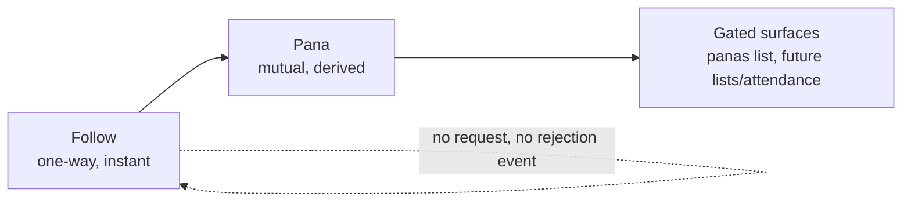

# Social Graph — Model, Discovery & Safety

> **STATUS**: Mixed. Read the status of each section before building from it.
>
> - **[The Model](#the-model)** — **shipped and now ratified.** Pana = mutual follow. This section
>   documents a decision to _keep_ existing behaviour, not to change it.
> - **[Naming](#the-word-does-three-jobs)** — **copy fixes pending.** The word currently carries
>   three different meanings in shipped UI.
> - **[Follows You badge](#decision-1--the-follows-you-badge)** and
>   **[owner-only Pana count](#decision-2--the-pana-count-is-owner-only)** — **approved, not built.**
> - **[Discovery](#a--discovery-through-shared-activity)** and **[Block & mute](#b--block--mute)** —
>   **proposals.** No table, route, or component described there exists.
>
> The next free migration number is `0050` (`origin/main` holds through `0049_event_search_vector`).

## Table of Contents

- [Why This Document Exists](#why-this-document-exists)
- [What Already Exists](#what-already-exists)
- [The Model](#the-model)
- [The Word Does Three Jobs](#the-word-does-three-jobs)
- [Decision 1 — The "Follows You" Badge](#decision-1--the-follows-you-badge)
- [Decision 2 — The Pana Count Is Owner-Only](#decision-2--the-pana-count-is-owner-only)
- [A — Discovery Through Shared Activity](#a--discovery-through-shared-activity)
- [B — Block & Mute](#b--block--mute)
- [Roadmap](#roadmap)
- [Risks & Open Questions](#risks--open-questions)

---

## Why This Document Exists

`SOCIAL-ROADMAP.md` covers the federation plumbing — actors, statuses, inbox delivery, what is
imported from activities.next. It does not describe the _relationship model_: what a connection
means, who can see it, and how two panas who should know each other actually find one another.

That gap is why the same word ended up meaning three different things in shipped UI, and why
discovery still falls back to "recently joined" for anyone without a graph.

The product goal that decides most arguments below, stated by the product owner:

> _"I want to prioritize connection, and at the same time I want to make it easy for panas to find
> each other."_

Those two goals pull in different directions more often than they look like they should, and most
of the reasoning here is about which one wins where.

---

## What Already Exists

Everything in this section was read from the code, not inferred. File references are current as of
this document's commit.

### Follows are asymmetric and nobody approves anything

| Case                      | Status on insert | Where                                                |
| ------------------------- | ---------------- | ---------------------------------------------------- |
| Local → local             | `accepted`       | `lib/federation/wrappers/follow.ts` (`createFollow`) |
| Local → remote            | `pending`        | same — awaits a remote `Accept`                      |
| Remote → local (incoming) | `accepted`       | `lib/federation/inbox-handler.ts` (~L145)            |

Incoming federated follows are accepted outright, with an auto-`Accept` sent back. The code's own
comment calls this "immediately accepted for POC."

**The `social_follow_status` enum is misleading.** It is `pending | accepted | rejected`
(`lib/schema/index.ts` L128) and defaults to `pending`, but:

- `pending` only ever applies to _outbound remote_ follows waiting on another server.
- **`rejected` is never written anywhere in the codebase.**
- There is no accept/reject endpoint. No approval UI exists because no approval exists.

The effective model is Twitter-public / Mastodon-unlocked.

### A Pana is a mutual follow

`countMutualFollows` and `listMutualFollows` (`follow.ts` L318, L336) self-join `social_follows`
through a `reciprocal` alias, requiring **both** directions to be `accepted`. Following four
hundred people produces zero Panas unless they follow back.

This is already a real permission boundary, not a label. `GET /api/social/actors/[username]/panas`
returns `count` to everyone and the `actors` list only to signed-in viewers — see
[Decision 2](#decision-2--the-pana-count-is-owner-only), which changes this.

### Discovery is graph-only, and local-only

`listSuggestedActors` (`follow.ts` L360–487) returns two tiers:

1. **Panas in common** — a bilateral graph walk, carrying a real `mutualCount`.
2. **Recently joined locals** — cold-start filler, `mutualCount: 0`.

Suggestions are deliberately local-only. A mixed local/remote list cannot label its buttons
truthfully, because a remote follow sits `pending` and "Following" would be a lie on half the
cards.

Tier 2 is the honest part of the problem: it is the system admitting the graph cannot help someone
who does not already have one.

### There is no block or mute

No table, no route, no UI. `listSuggestedActors` flags this explicitly — when blocking lands it
must be subtracted there too, "or this module becomes the one place a blocked account reappears."

---

## The Model

**Decision: keep Pana = mutual follow. Derived, never requested, never approved.**



### Why not a friend model

The friend model's real cost in a small local scene is **rejection**. Declining a stranger on a
global network is free. Declining someone you will see at a show in Little Haiti next month is
socially loaded — and so is the request that sits unanswered for three weeks.

A derived mutual never generates that event. You simply do not follow back, and _"I didn't get
around to it"_ stays permanently available to both parties. In a community where everybody
overlaps in person, that ambiguity is a feature.

There is a technical cost too: ActivityPub is follow-shaped. An approval model means either locked
accounts with follow requests or fighting the protocol.

### Why the name is right

Not novelty — **reciprocity is already in the word.** _Somos panas_ takes two people. You can
follow someone unilaterally; you cannot really be someone's pana unilaterally.

So the mutual definition is not a technical constraint bolted onto a warm word. It is the meaning
the word already has in the language this community speaks, which means the concept explains
itself without a tooltip.

### Honest note on prior art

The mechanism is not new:

- **Snapchat** is the close precedent — add someone, they add back, you are friends and features
  unlock. No approval dialog; the mutual state _is_ the relationship.
- **"Mutuals"** is a universal folk concept on Twitter, Bluesky and Instagram. All three show a
  _follows you_ badge. None of them make it a named tier.

What is uncommon is the **combination**: a derived mutual that is both _named_ and _load-bearing
for permissions_. On Twitter, mutuals is a vibe. Here it is a capability. That combination is the
distinctive part — the underlying graph operation is ordinary, and we should not tell ourselves
otherwise.

### Local-first precedent worth keeping in view

The most durable local networks de-emphasise the person graph entirely:

| Approach    | Example                     | Organising unit   |
| ----------- | --------------------------- | ----------------- |
| Place-first | Nextdoor, Front Porch Forum | Verified address  |
| Group-first | Buy Nothing, Discord, Band  | The group         |
| Event-first | Meetup, Partiful            | Co-attendance     |
| Vouch       | Lobsters, Metafilter        | Invitation chains |
| Capped      | Path (~150, Dunbar)         | Scarcity          |

Front Porch Forum has run for years in Vermont with essentially no social graph — it is a
neighbourhood digest. Buy Nothing is hyperlocal groups with no friending. Their shared lesson is
that in local community, **place and activity carry the connective load that a follow graph
carries globally.** That lesson is what [section A](#a--discovery-through-shared-activity) acts on.

---

## The Word Does Three Jobs

This is already shipped and already inconsistent.

| Where                                                                              | Meaning           | Kind       |
| ---------------------------------------------------------------------------------- | ----------------- | ---------- |
| Rail stat, suggestions copy, `/panas` endpoint                                     | Mutual follow     | Bilateral  |
| **Feed tab "Panas"** (`feed-page.tsx` L47)                                         | People you follow | Unilateral |
| "Ask the Panas", "hosted by Panas", "N Panas going", "Find Panas in the directory" | Any member        | Everyone   |

The codebase already knows. `feed-page.tsx` carries a comment flagging it as a live hazard:

> _"'Panas' in particular means mutual follows elsewhere in this product (the rail counts them that
> way), while `/api/social/timeline` documents itself as 'posts from followed accounts + own'. The
> label is the one the design approved; the hint is what the endpoint actually returns, and the two
> must not be allowed to drift apart silently."_

A full-sentence hint was used to paper over the conflict rather than resolve it.

### Resolution

**"Pana" is reserved for the mutual relationship.** The loose "any member" usages become
_members_ / _the community_ / _Pana Mia members_.

Strings to change (roughly six, all cheap):

| File                    | Current                                            |
| ----------------------- | -------------------------------------------------- |
| `feed-modules.tsx` L94  | "Markets, workshops, and dinners hosted by Panas." |
| `feed-modules.tsx` L149 | "N Panas going"                                    |
| `feed-page.tsx` L160    | "Ask the Panas something…"                         |
| `feed-page.tsx` L306    | "go and find Panas"                                |
| `feed-page.tsx` L316    | "Find Panas in the directory…"                     |
| `stories-rail.tsx` L9   | "the panas they follow"                            |

**The feed tab is renamed `Following`, not made mutual-only.** On a network this young a
mutuals-only timeline would be close to empty, and an empty feed is the worst available first
impression. The label changes to match the endpoint; the endpoint does not change to match the
label.

---

## Decision 1 — The "Follows You" Badge

**Status: approved, not built.**

Derived-mutual has one well-known failure mode: **it is invisible.** Nothing tells you why a
surface unlocked. Twitter gets away with it because nothing depends on mutuals. Here things do.

So the relationship state must be legible wherever a follow decision is offered:

| Viewer sees                | Badge           | Action label |
| -------------------------- | --------------- | ------------ |
| They follow you, you don't | **Follows you** | Follow back  |
| You follow, they don't     | —               | Following    |
| Both                       | **Pana**        | Following    |
| Neither                    | —               | Follow       |

Surfaces: profile header, suggestion cards, follower/following lists, directory results.

The row that earns this feature is the first one. "Follows you" turns a hidden mechanic into a
connection prompt — it tells somebody they are one tap away from a Pana. That single badge does
more for the connection goal than any counter, because it is actionable rather than decorative.

`getFollowRelationship` already exists in `follow.ts` and returns both directions, so the data is
there. This is a rendering change plus making sure list endpoints carry the pair.

---

## Decision 2 — The Pana Count Is Owner-Only

**Status: approved, not built.** Product owner:

> _"In the main page the user sees how many panas they have, but it's hidden when others see their
> page. So it's a detail only they have."_

### What changes

| Surface                             | Today       | After                             |
| ----------------------------------- | ----------- | --------------------------------- |
| Own feed rail (`feed-rail.tsx` L92) | Count shown | **Unchanged** — already self-only |
| Own profile                         | Count shown | Count shown                       |
| Someone else's profile              | Count shown | **Hidden**                        |
| `/panas` `count` for a non-owner    | Returned    | **Not returned**                  |

The feed rail needs no change — it only ever renders the signed-in user's own sidebar.

### Three consequences that must land together

**1. The list has to follow the count.** Today `canSeeList` is `Boolean(session?.user?.id)` — _any_
signed-in viewer can read the full list of who you are panas with. Hiding the aggregate while
leaving every name readable is incoherent, and worse than doing nothing: it would look like
privacy without being privacy. If the count is owner-only, `canSeeList` must become
`session.user.id === owner`.

**2. The route's docblock currently argues the opposite.** It justifies a public count on the
grounds that "every person inside it chose the connection from both sides, so it reveals nothing
one party can impose on another." That reasoning is sound and this decision overrides it anyway,
on different grounds: a visible count is a vanity metric, and vanity metrics build audiences rather
than connections. **The comment must be rewritten in the same commit as the behaviour.** A comment
left contradicting its code is exactly how the last production defect stayed invisible.

**3. The Panas tab disappears for visitors.** `personal-profile.tsx` renders Panas as both a stat
(L70) and a tab. For a non-owner, the tab must not render at all — a locked or empty tab is worse
than an absent one. Profiles therefore carry one fewer tab for visitors than for the owner, which
is a deliberate asymmetry and should be stated in the component.

### What stays public

The **Pana badge** on a profile stays visible to everyone. Knowing that you and someone are
connected is different from being able to enumerate or count their connections — the first is
context, the second is a graph map. Keeping the badge is what preserves the social meaning of the
tier after the number goes away.

---

## A — Discovery Through Shared Activity

**Status: proposal.**

Graph-based discovery has a cold-start problem that a local network feels sooner than a global
one. The current second tier — "recently joined" — is the system saying it has nothing better.

But the strong local signals already exist in the database and none of them are wired into
discovery:

| Signal          | Source                      | Reason string shown to user              |
| --------------- | --------------------------- | ---------------------------------------- |
| Co-attendance   | event attendees             | "You were both at Nochebuena en Wynwood" |
| Co-membership   | `social_group_members`      | "Both in Little Haiti Creatives"         |
| Shared taste    | recommendation lists (#234) | "You both recommend Café La Palma"       |
| Proximity       | profile neighbourhood / zip | "Also in Little Havana"                  |
| Panas in common | existing graph walk         | "3 Panas in common"                      |

### Why this beats more graph

- **It works on day one.** The first fifty members have no graph. They do have a neighbourhood and
  an event they went to.
- **The reason is explainable and true.** _"You were both at this"_ is a better introduction to a
  stranger than _"3 mutual panas"_, and it is verifiable by the person reading it.
- **It is local.** Co-attendance at a Miami show is a signal a global network cannot generate and
  cannot copy. This is the part that makes the product specifically about this place.

### Shape

Extend `listSuggestedActors` from two tiers to a ranked union, each candidate carrying a typed
reason rather than a bare number:

```ts
type SuggestionReason =
  | { kind: 'panas_in_common'; count: number }
  | { kind: 'co_attended'; eventId: string; eventTitle: string }
  | { kind: 'co_member'; groupId: string; groupName: string }
  | { kind: 'shared_recommend'; profileId: string; profileName: string }
  | { kind: 'nearby'; neighborhood: string };
```

`/api/social/suggestions` already returns `mutualCount` rather than a rendered string
specifically so copy stays in the UI layer — the same discipline applies to reasons. The route
returns structured reasons; the component renders them.

Constraints carried over from today's implementation: **local actors only** (remote follows sit
`pending`, so the button cannot be labelled honestly), and **every tier must be filtered by
[block/mute](#b--block--mute)** once that exists.

Ordering should prefer specific over generic — a shared event beats a shared neighbourhood, because
everyone shares a neighbourhood with thousands of people.

---

## B — Block & Mute

**Status: proposal. Prerequisite for shipping [A](#a--discovery-through-shared-activity).**

No block or mute exists today. In a geographically local network this matters more than in a
global one: avoiding an ex, a harasser, or a former employer is a _local_ safety need, and the
people involved are people you will physically encounter.

Right now nothing stops someone following you, and discovery may actively resurface them. A model
with no approval step needs an escape hatch, or "no approval" becomes "no recourse."

### Two different tools

|                        | Block                                      | Mute                         |
| ---------------------- | ------------------------------------------ | ---------------------------- |
| Follows                | Severed both directions, re-follow blocked | Untouched                    |
| Their feed view of you | Your public posts hidden                   | Unchanged                    |
| Your feed              | They disappear                             | They disappear               |
| Discovery              | Removed from both sides                    | Removed from yours           |
| Visible to them        | Not announced                              | Not announced                |
| Use case               | Safety                                     | "I like you, not your posts" |

Mute is the one people reach for most often and the one that keeps a small community livable —
it lets somebody stay connected to a neighbour whose posting volume they cannot stand, which is a
very local problem.

### Schema sketch (migration `0050`)

```
social_blocks
  id, actor_id, target_actor_id, kind ('block' | 'mute'), created_at
  unique (actor_id, target_actor_id, kind)
  index on (actor_id), index on (target_actor_id)
```

A single table with a `kind` discriminator rather than two tables: every read path needs to ask
"is there anything between these two actors," and one indexed lookup beats two.

### Every surface that must subtract it

This list is the actual work; the table is trivial by comparison.

- `listSuggestedActors` — called out in its own comments as the place a blocked account would
  otherwise reappear
- Timeline / feed queries, all three filters
- Follower and following lists
- `countMutualFollows` / `listMutualFollows` — a block severs the follows, so this should follow
  naturally, but it needs a test
- Stories rail
- Notifications
- Search and directory results
- Federation: an incoming `Follow` from a blocked actor must be rejected rather than auto-accepted
  — this is the one place `social_follow_status.rejected` would finally get written

### Federation reality check

ActivityPub has a `Block` activity, but remote servers may ignore it, and announcing a block to the
blocked instance leaks information. The honest scope is **local enforcement only**: we control what
our server shows and delivers. That limitation should be stated in the UI rather than implied, in
the same spirit as `PRIVACY-ROADMAP.md`'s note that remote servers may ignore `Delete`.

---

## Roadmap

### Phase 1 — Naming and legibility

- [ ] Rename feed tab `Panas` → `Following`; keep the explanatory hint
- [ ] Fix the six "Pana = any member" strings
- [x] Add `Follows you` / `Pana` badges to the personal profile, suggestion cards and directory results
- [ ] Add the same badges to follower and following lists — blocked on the line below
- [ ] Ensure list endpoints return both follow directions

`/api/social/follows` currently returns the listed actor only, with no indication of whether the
viewer follows them or they follow the viewer. `ActorList` therefore has nothing to render a badge
from. That endpoint has to carry both directions before the list surfaces can be finished, which is
why those two boxes are still open.

### Phase 2 — Pana count privacy

- [ ] `/panas`: owner-only `count`, `canSeeList` becomes owner-only
- [ ] Rewrite the route docblock in the same commit
- [ ] Hide the Panas stat and tab for non-owners
- [ ] Keep the Pana badge public

### Phase 3 — Block & mute

- [ ] Migration `0050` + journal entry
- [ ] Wrappers, routes, and the subtraction pass across every surface listed above
- [ ] Reject incoming federated follows from blocked actors
- [ ] Settings screen listing blocks and mutes

### Phase 4 — Activity-based discovery

- [ ] Typed `SuggestionReason`
- [ ] Co-attendance, co-membership, shared-recommend and proximity tiers
- [ ] Ranking: specific before generic
- [ ] Block/mute filtering on every tier

Phase 3 lands before Phase 4 on purpose. Discovery amplifies reach, and amplifying reach without an
escape hatch is the wrong order.

---

## Risks & Open Questions

**The `rejected` enum value stays dead until blocking ships.** Worth leaving a comment on the enum
saying so, because it currently reads like an approval flow that was built and lost.

**Owner-only counts weaken the Panas tab's original justification.** The tab exists because "a
profile with four hundred Panas needs somewhere for the rest of them to be." If only the owner can
see it, the tab is a personal index rather than a public one. That may be fine — but it is a
different feature than the one that was designed, and it should be revisited rather than inherited.

**Co-attendance has a consent question.** Event attendance is currently owner-only. Using it to
generate suggestions exposes it indirectly: _"you were both at X"_ tells someone that the other
person attended X. This needs either an opt-in, or restriction to events where attendance is
already public. **Do not build the co-attendance tier before resolving this.**

**Proximity has the same shape.** Surfacing neighbourhood-level suggestions is a disclosure for
people who did not expect their neighbourhood to be a discovery key. Neighbourhood granularity is
probably acceptable; anything finer is not.

**No cap is proposed.** Path capped friends at ~150 to force intentionality. We are not doing that,
because the directory half of the product needs businesses to be followable without limit. Worth
remembering that the cap option exists if the graph later turns into an audience race.

**Mutual-only feed remains untried.** If the network gets dense enough that a Panas-only timeline
would be full, it becomes worth revisiting as an option — not as a replacement for Following.
